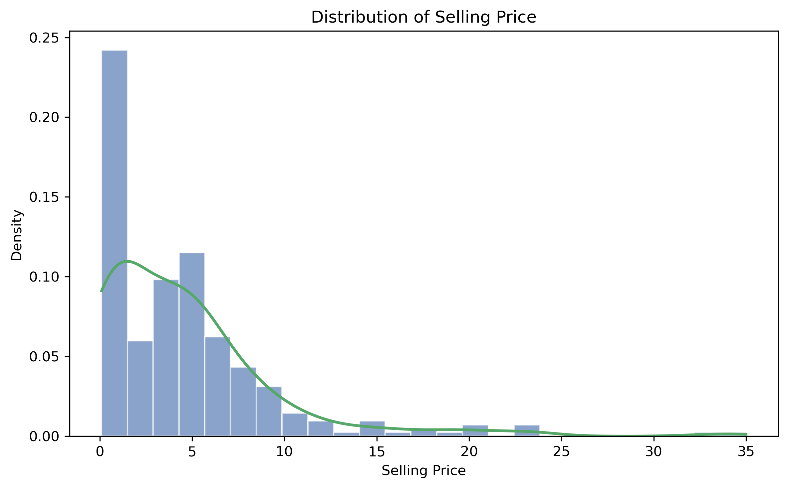
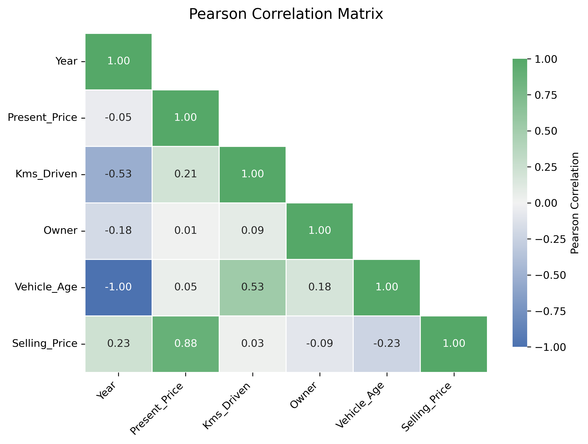
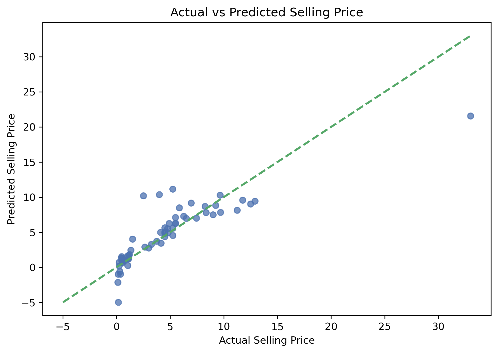
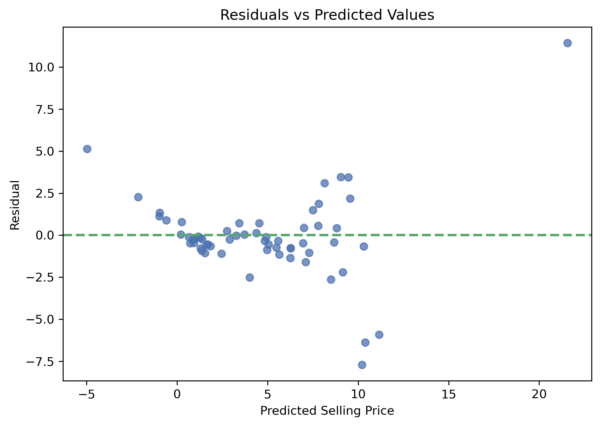
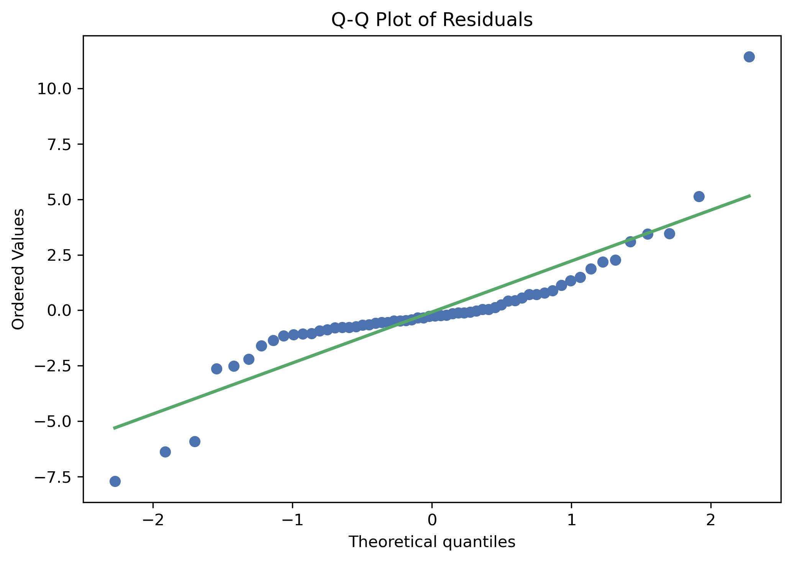

# Used Car Price Prediction with Linear Regression

An end-to-end regression project for predicting used-car selling prices with an interpretable Linear Regression baseline.

The project focuses on more than the final score. It shows how categorical variables, feature engineering, data leakage prevention, residual diagnostics, and cross-validation fit together in a clean machine learning workflow.

---

## Learning Resources

This repository also includes focused notes that connect the modeling decisions to the underlying concepts:

- [Categorical Features in Regression](docs/categorical_features_in_regression.md)
- [Statistics for Car Price Regression](docs/statistics_for_car_price_regression.md)
- [Jupyter Notebook](notebooks/used_car_price_linear_regression.ipynb)

---

## 1. Project Overview

The goal is to predict `Selling_Price` from a mix of numerical and categorical vehicle features.

Because the target is continuous, this is a **supervised regression** problem. I use Linear Regression as the first benchmark because it is transparent, easy to inspect, and useful for understanding the structure of the data before moving to more flexible models.

This project adds several challenges that are especially useful for a portfolio:

- categorical variables,
- a high-cardinality vehicle-name field,
- feature engineering for vehicle age,
- duplicate records,
- and leakage-safe preprocessing inside a pipeline.

---

## 2. Problem Statement

The project is built around four practical questions:

1. Which vehicle characteristics are most clearly related to selling price?
2. How should nominal categorical variables be represented without introducing artificial numeric order?
3. How well does a linear baseline generalize to unseen cars?
4. What do residuals and cross-validation reveal that a single R² score cannot?

The dataset does not document a currency or price unit, so the model errors are reported in the dataset's native target units rather than assigning a currency that is not explicitly supported.

---

## 3. Dataset

The dataset contains **301 rows and 9 original columns**.

The initial data-quality review found:

- no missing values,
- **2 exact duplicate rows**,
- 98 unique values in `Car_Name`,
- 3 fuel categories,
- 2 seller categories,
- 2 transmission categories.

The two duplicate rows are removed before the train/test split.

### Feature Dictionary

| Feature | Description |
|---|---|
| `Car_Name` | Car name / model label |
| `Year` | Production year |
| `Selling_Price` | Sale price — **target** |
| `Present_Price` | Current listed/present price |
| `Kms_Driven` | Distance driven in kilometers |
| `Fuel_Type` | Fuel category |
| `Seller_Type` | Seller category |
| `Transmission` | Manual or automatic transmission |
| `Owner` | Number/category of previous owners |

---

## 4. Feature Engineering

The raw `Year` column is converted into a more interpretable age feature:

```text
Vehicle_Age = 2019 - Year
```

The reference year is fixed at 2019, one year after the newest production year in the dataset. This keeps the calculation reproducible and makes the coefficient easier to interpret than a raw calendar year.

`Car_Name` is excluded from the baseline because it has high cardinality relative to the size of the dataset. A later model could revisit this using grouping, rare-category handling, or leakage-safe encoding.

---

## 5. Data Preprocessing

The preprocessing workflow is designed to keep the model consistent and leakage-safe.

### Categorical Features

The categorical variables are:

- `Fuel_Type`
- `Seller_Type`
- `Transmission`

These are nominal categories, so assigning numbers such as `1`, `2`, and `3` would create an artificial order that does not exist in the data.

Instead, the project uses **One-Hot Encoding** inside a Scikit-learn `ColumnTransformer`.

Reference categories are chosen for interpretability:

- `Petrol`
- `Dealer`
- `Manual`

### Pipeline

Preprocessing and model fitting are combined in one pipeline:

```text
Raw Features
    ↓
ColumnTransformer
    ├── Numeric Features → passthrough
    └── Categorical Features → One-Hot Encoding
    ↓
Linear Regression
```

Keeping preprocessing inside the pipeline ensures that the same transformations are applied during training, cross-validation, testing, and future prediction.

Feature scaling is not required for this Ordinary Least Squares baseline, so the numeric variables remain in their original units.

---

## 6. Exploratory Data Analysis

The EDA focuses on patterns that matter for the linear baseline:

- target distribution,
- Pearson correlation between numeric variables,
- numeric feature vs. target relationships,
- category-level price differences,
- and IQR-based outlier diagnostics.

A few patterns stand out:

- `Present_Price` has a strong positive linear relationship with `Selling_Price`.
- Vehicle age has a negative relationship with selling price.
- Category-level differences are visible across fuel type, seller type, and transmission.
- Several observations are flagged as unusual by the IQR rule, but they are not automatically removed.

The Pearson correlation matrix is limited to numerical variables because text categories do not have a meaningful raw Pearson correlation.

### Selling Price Distribution

The target distribution is right-skewed, with most vehicles concentrated in the lower-to-middle selling-price range and a smaller number of substantially more expensive cars. That shape is useful context for later error analysis because large-price observations can have a noticeable effect on squared-error metrics.



### Pearson Correlation Matrix

The correlation matrix focuses on the numerical variables and places `Selling_Price` at the end for easier reading. `Present_Price` shows the clearest positive linear relationship with the target, while vehicle age moves in the opposite direction.



---

## 7. Statistical Analysis

The statistical ideas used in the project are tied directly to modeling decisions:

- mean and median,
- variance and standard deviation,
- Pearson correlation,
- covariance,
- outlier diagnostics,
- residual analysis,
- normality assessment,
- and sampling variability across train/validation splits.

The IQR rule is used as a diagnostic rather than an automatic deletion rule. An unusual value may still be valid, so clipping or removing it without investigation can distort the data.

---

## 8. Model

The baseline model is **Linear Regression**.

It represents the target as a weighted combination of the transformed input features:

```text
Prediction = Intercept + Coefficient₁ × Feature₁ + ... + Coefficientₙ × Featureₙ
```

The coefficients are estimated using Ordinary Least Squares (OLS), which minimizes the sum of squared residuals.

Because categorical variables are one-hot encoded, their coefficients are interpreted relative to the chosen reference category while holding the other model inputs constant.

---

## 9. Model Training

The cleaned data is split into training and test sets using:

```text
test_size = 0.20
random_state = 42
```

After duplicate removal, this produces:

- **239 training rows**
- **60 test rows**

The entire preprocessing + modeling pipeline is fitted only on the training data.

---

## 10. Evaluation Metrics

The model is evaluated using:

- **MAE — Mean Absolute Error**
- **MSE — Mean Squared Error**
- **RMSE — Root Mean Squared Error**
- **R² — Coefficient of Determination**
- **Adjusted R²**

Lower values are better for MAE, MSE, and RMSE.

Higher values are generally better for R² and Adjusted R².

The numerical metrics are supported by:

- actual vs. predicted values,
- residuals vs. predicted values,
- residual distribution,
- Q-Q plot,
- and 5-fold cross-validation.

---

## 11. Results

### Test Set Performance

| Metric | Result |
|---|---:|
| MAE | ~1.47 |
| MSE | ~6.37 |
| RMSE | ~2.52 |
| R² | ~0.753 |
| Adjusted R² | ~0.714 |

The held-out result shows that the linear baseline captures a meaningful part of the variation in selling price, while still leaving noticeable prediction error.

### 5-Fold Cross-Validation

| Metric | Mean | Std. Dev. |
|---|---:|---:|
| R² | ~0.852 | ~0.054 |
| MAE | ~1.231 | ~0.169 |
| RMSE | ~1.870 | ~0.478 |

The cross-validation average is stronger than the single held-out split. On a dataset this small, that difference is worth reporting rather than presenting one split as the definitive estimate of model performance.

### Actual vs. Predicted Selling Price

The actual-versus-predicted plot provides a direct visual check of how closely the model follows the observed selling prices. Points near the reference line indicate good agreement, while larger departures highlight cases where the linear baseline misses more of the price variation.



---

## 12. Model Interpretation

The fitted feature names are extracted directly from the trained preprocessing pipeline, so coefficients do not need to be hard-coded.

For numerical features, a coefficient represents the expected change in predicted selling price for a one-unit increase in that feature, holding the remaining model inputs constant.

For one-hot encoded variables, coefficients are interpreted relative to their reference category.

Raw coefficient magnitudes should not be treated as a feature-importance ranking because the numerical features use different units and scales.

---

## 13. Residual Diagnostics

Residual analysis is used to look beyond the headline metrics.

The project checks:

- whether residuals are centered around zero,
- whether residual variance changes across the prediction range,
- and whether the residual distribution departs strongly from normality.

The diagnostics support Linear Regression as a useful baseline, but they also suggest that nonlinear relationships and interactions may still be present.

### Residuals vs. Predicted Values

Ideally, residuals should be scattered around zero without a strong pattern. This plot helps identify whether the model systematically over- or under-predicts in particular parts of the prediction range.



### Q-Q Plot of Residuals

The Q-Q plot compares the residual distribution with a theoretical normal distribution. Departures from the reference line, especially in the tails, provide a useful warning that the residuals are not perfectly normal.



---

## 14. Conclusion

Linear Regression provides a useful and interpretable benchmark for this dataset.

The project is especially valuable for demonstrating workflow decisions that can easily go wrong in a regression problem:

- nominal categories should not be assigned arbitrary ordered numbers,
- exact duplicates should be handled before evaluation,
- outliers should be investigated rather than clipped by default,
- preprocessing should stay inside a pipeline,
- and new predictions should pass through the same fitted preprocessing used during training.

The baseline is reasonably predictive, but the residuals and split-to-split variation leave room for models that can capture more complex relationships.

---

## 15. Future Improvements

The next experiments I would prioritize are:

- Ridge Regression
- Lasso Regression
- Elastic Net
- Polynomial Regression
- Random Forest Regression
- Gradient Boosting Regression
- repeated cross-validation
- influence diagnostics
- high-cardinality handling for `Car_Name`
- hyperparameter tuning after a fair baseline comparison

---

## 16. Technologies & Libraries

### Language

- Python

### Libraries

- NumPy
- Pandas
- Matplotlib
- Seaborn
- SciPy
- Scikit-learn

### Tools

- Jupyter Notebook
- Git
- GitHub
- Kaggle

---

## 17. Kaggle Notebook

The Kaggle notebook link will be added after the executable version is published.

---

## Project Structure

```text
used-car-price-linear-regression/
│
├── README.md
├── .gitignore
├── requirements.txt
│
├── data/
│   └── car_data.csv
│
├── notebooks/
│   └── used_car_price_linear_regression.ipynb
│
├── docs/
│   ├── categorical_features_in_regression.md
│   └── statistics_for_car_price_regression.md
│
└── images/
    ├── selling_price_distribution.png
    ├── correlation_matrix.png
    ├── actual_vs_predicted.png
    ├── residuals_vs_predicted.png
    └── qq_plot_residuals.png
```

---

## What I Learned

The biggest improvement in this project was not a more complicated model. It was making the workflow internally consistent.

The project reinforced several habits that I want to carry into later machine learning work:

- encode nominal categories in a way that matches their meaning,
- fit preprocessing only inside the training workflow,
- use a pipeline so training and prediction follow the same path,
- treat outlier rules as diagnostics rather than automatic deletion rules,
- compare a held-out split with cross-validation,
- and interpret model coefficients only after understanding how the features were transformed.

That makes the baseline easier to trust, easier to explain, and easier to improve.
